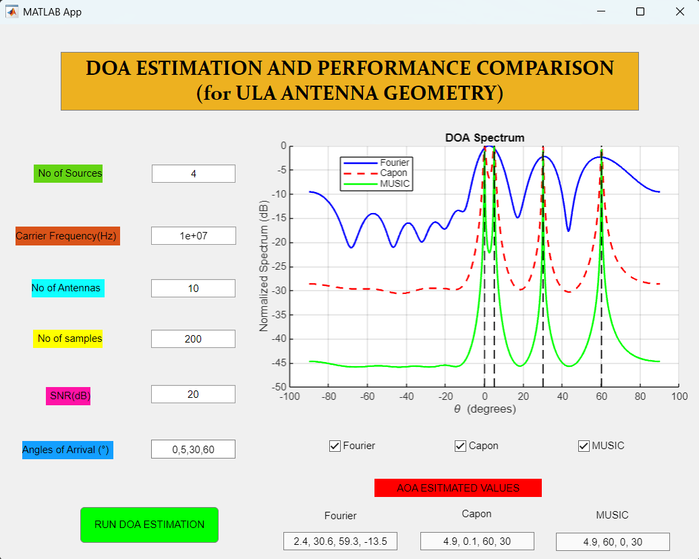

# 🎯 DOA Estimation and Comparison (MATLAB App)

This MATLAB App provides a graphical interface to perform **Direction of Arrival (DOA)** estimation using three popular algorithms under a **Uniform Linear Array (ULA)** setup:

- 📡 **MUSIC** (Multiple Signal Classification)
- 🎧 **Capon (MVDR)** (Minimum Variance Distortionless Response)
- 📶 **Conventional Fourier Beamforming**

The app visualizes the spatial spectrum of these methods and identifies the estimated angles of arrival (AOA) of the signal sources. Users can compare algorithmic performance directly on the GUI.

---

## 💻 App Features

- 🎛 **Interactive UI** built using App Designer  
- 🎯 Supports estimation of up to `K` sources (user-defined)  
- 🧠 Automated peak detection to estimate AOA  
- 📊 Displays normalized spatial spectra of all three methods  
- ✔️ Checkboxes to toggle display of MUSIC, Capon, and Fourier plots  
- 📝 Estimated AOAs shown in separate editable fields  
- 🔄 Axes and plots automatically update upon each run

---

## 🧾 User Inputs (via GUI)

The app allows user to set the following parameters:
- `SNR` (in dB)
- `Carrier Frequency` (in Hz)
- `Number of Samples` used for snapshot collection
- `Number of Antennas` in the ULA
- `Number of Sources`
- `Angles of Arrival` (comma-separated, e.g., `30,45`)

---

## 📁 Files

📂 DOA_Estimation_App/
├── DOA_estimation.mlapp          % Main App (GUI) 
├── find_peaks_doa.m              % Custom Peak detection function for DOA estimation 
├── number_sources_estimation.m   % Custom method to estimate number of sources using MDL  
├── Multiple_source_DOA.m         % Basic script to compare all 3 algorithms (non-GUI) 
└── README.md

## ⚙️ Requirements

- MATLAB R2021a or newer  
- App Designer support (for `.mlapp`)  
- Signal Processing Toolbox (recommended)  

---

## 🧑‍💻 Notes

- Designed for **ULA geometry**
- Estimation assumes **narrowband, far-field signals**
- Grid search is performed over **[-90°, +90°]**

---

## 📄 License

MIT License – Free for academic and personal use.
